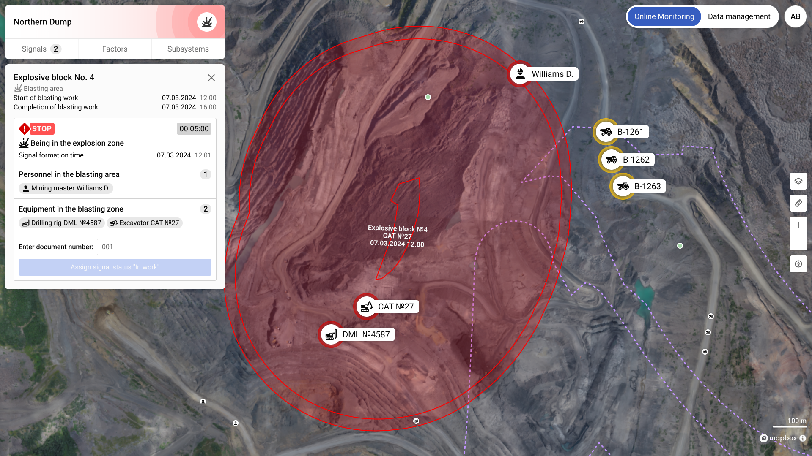

# Geofencing Service



Read more about our geofencing services [here](https://geosemantica.com/post/3d-geofencing-mining-safety-monitoring) 

## Description

This project provides a geofencing service that determines the location of entities relative to defined hazardous zones. It interacts with a PostgreSQL database and utilizes message queues for real-time updates and notifications.

## Features
- **Geospatial Data Handling**: The service processes and analyzes geospatial data using GeoAlchemy and GeoPandas.
- **Database Integration**: Uses PostgreSQL for storing and querying geospatial data.
- **Asynchronous Operations**: Supports asynchronous communication with message queues (RabbitMQ) for handling notifications and updates.
- **API**: FastAPI provides a RESTful API for interacting with the service.
- **Docker Support**: The service can be deployed in a Docker container for easy setup and scalability.

## Requirements
- **Python 3.12** or higher
- **PostgreSQL 16**
- **RabbitMQ**

## Installation

1. Clone the repository:
    ```bash
    git clone <repository-url>
    cd <repository-directory>
    ```

2. Set up a virtual environment and install dependencies:
    ```bash
    python3 -m venv venv
    source venv/bin/activate
    pip install -r requirements.txt
    ```

3. Create a `.env` file to store environment variables:
    ```bash
    POSTGRES_DATABASE=testbase
    POSTGRES_USER=postgres
    POSTGRES_PASSWORD=password
    POSTGRES_HOST=localhost
    POSTGRES_PORT=5432
    MQ_HOST=localhost
    MQ_PORT=5672
    MQ_VIRTUAL_HOST=testhost
    MQ_USERNAME=user
    MQ_PASSWORD=password
    OUTBOX_BATCH_SIZE=100
    ```

## Running with Docker

1. Build the Docker image:
    ```bash
    docker build -t geofencing-service .
    ```

2. Run the container:
    ```bash
    docker run -d --name geofencing-service -p 8000:8000 geofencing-service
    ```

The service will be accessible at `http://localhost:8000`.

## Environment Variables
The following environment variables must be set for the service:

- **PostgreSQL Configuration**:
    - `POSTGRES_DATABASE`, `POSTGRES_USER`, `POSTGRES_PASSWORD`, `POSTGRES_HOST`, `POSTGRES_PORT`
- **Message Queue (MQ) Configuration**:
    - `MQ_HOST`, `MQ_PORT`, `MQ_VIRTUAL_HOST`, `MQ_USERNAME`, `MQ_PASSWORD`
- **Outbox Configuration**:
    - `OUTBOX_BATCH_SIZE`, `OUTBOX_PUBLISH_ENABLED`, `OUTBOX_SCAN_INTERVAL`

## Database Setup
You can initialize the PostgreSQL database by running the SQL dump located at `postgresql/initial-dump.sql`.

## Usage
- Interact with the API via the FastAPI interface available at `/docs`.
- The service listens for geospatial updates and processes them in real time.

## License
This code is private and proprietary. It cannot be copied, modified, distributed, or used under any circumstances 
without explicit permission from the owner. Unauthorized use of this code is strictly prohibited.
